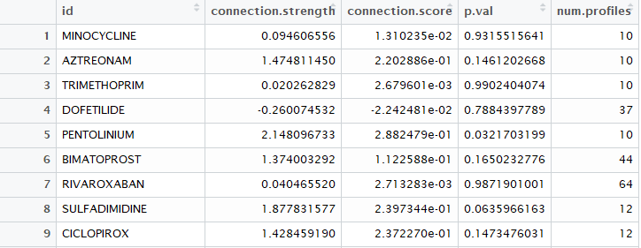

# QuadraticAPI

_Please note, this package is under development and the format of functions used here is not set in stone. Consequently, the way functions are called may break in future builds. For any queries, please email me at [meicaljohnjones@gmail.com](mailto:meicaljohnjones@gmail.com). Pull requests are welcome!_

The aim of QuadraticAPI is to provide an R wrapper for Paul O'Reilly's [QUADrATiC: scalable gene expression connectivity mapping for repurposing FDA-approved therapeutics](http://pure.qub.ac.uk/portal/en/publications/quadratic-scalable-gene-expression-connectivity-mapping-for-repurposing-fdaapproved-therapeutics(d536c74c-8eee-480e-a23e-656e1570416c).html). QUADrATiC exposes a web service interface which this package interacts with, making it easier to run batches of jobs against the server.

## Getting Started

* Ensure you have Java installed on your machine
* Download QUADrATiC from http://go.qub.ac.uk/QUADrATiC and follow instructions to install and run the software 
provided in `Manual.pdf`
* Ensure you have the `xml2` package installed by running
```R
install.packages('xml2')
```

* Download Hadley Wickham's `devtools` package and use it to install QuadraticAPI:
```R
install.packages('devtools')
devtools::install_github('hiraethus/QuadraticAPI')
```
* Run an example Connectivity Map. Up regulated and down regulated probe IDs are provided in a data.frame 
comprised of two columns: the first column being the probe IDs and the second column being the signed rank of the 
probe IDs. For an example `tsv`, see the data folder in the R package archive.

```R
library('QuadraticAPI')

estrogen.sig <- read.table('data/Estrogen.tsv', stringsAsFactors=F)
result <- analyze(estrogen.sig)
```
* *Note:* Probe IDs must be for the Affymetrix GeneChip U133A platform in order to be successful
* `result` will contain a data.frame and it should look something like this:

